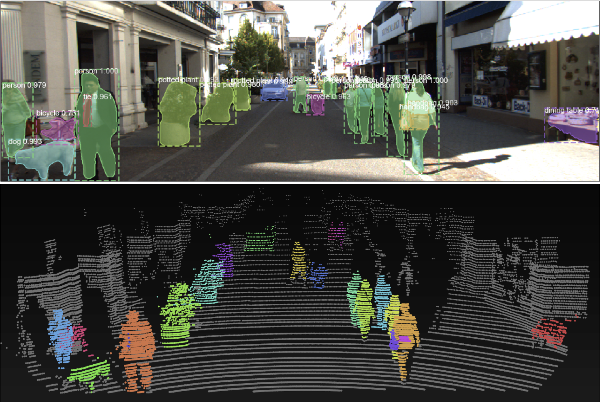

# LDLS: Label Diffusion Lidar Segmentation

*To Be Added: Evaluation data, and our GPU-accelerated revised implementation used to generate the results in the final paper*

LDLS performs 3D instance segmentation of Lidar point clouds, by using a pretrained Mask-RCNN model to perform 2D segmentation of an aligned camera image, projecting segmentation masks into 2D, and then performing label diffusion to output final LiDAR point labels.

LDLS requires no annotated 3D training data, and is capable of performing segmentation of any object class that the 2D image segmentation model is trained to recognize.

 or details on the algorithm, please see our paper, ["LDLS: 3-D Object Segmentation Through Label Diffusion From 2-D Images"](https://ieeexplore.ieee.org/document/8735751), published in the IEEE Robotics and Automation Letters (to be presented at IROS 2019 in Macau).

## Installation

Requires Python 3.6+

1. Install the Matterport Mask R-CNN implementation: See [here](https://github.com/matterport/Mask_RCNN).
2. Install dependencies with `pip install -r`

Additionally, we highly recommend installing the [Point Processing Toolkit](https://github.com/heremaps/pptk) for visualizing results:

``pip install pptk``

## How to use

See the `demo.ipynb` Jupyter notebook for an example of how to use LDLS.

## Evaluation Data

*To be added*

## Results

See the following videos for demonstrations of LDLS in action:

* [KITTI 64 Residential Road Sequence](https://youtu.be/XlXneiGB5NU)
* [KITTI 91 Urban Sequence](https://youtu.be/EtLl4KnuM-s)
* [Campus Mobile Robot Data Collection](https://youtu.be/4azvaDHEcQU)
